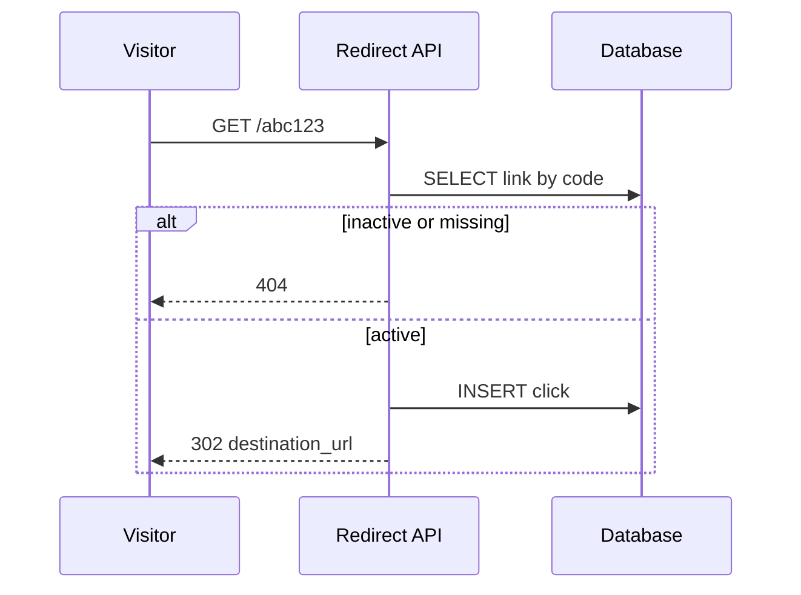
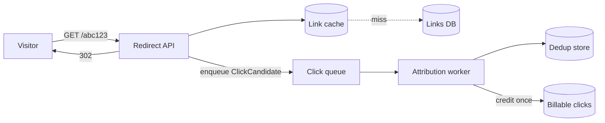
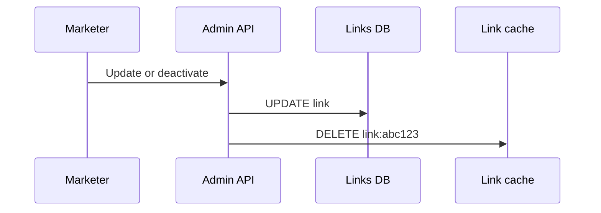
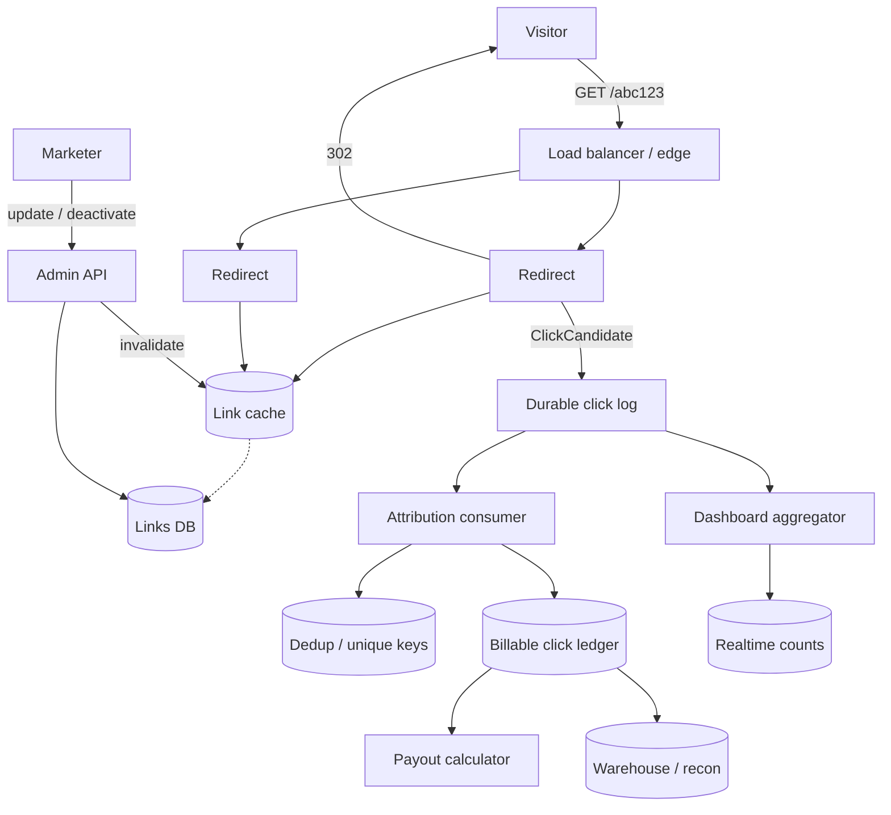

**Problem statement:** Marketers create short links (`go.ourapp.com/abc123`) that redirect visitors to a destination URL while crediting the correct affiliate for each real click — without making the visitor wait on analytics or payout work.

**Fraud (one line):** fraud/bot scoring plugs in as an async consumer or pre-credit filter on the click stream after redirect handoff, never on the 302 path.

### Understand
Two jobs, two columns on the board: **redirect** (fast, public) and **attribution** (careful, money). A deactivated or updated link must not keep sending people to the wrong place. A browser retry must not pay twice. If payout is down, the visitor should still leave.

---

### Pass 1 — Naive (sync everything)
On `GET /abc123`: DB lookup → if active, `INSERT` click → 302. Reason: proves credit exists in the simplest way.

**What breaks:** redirect waits on INSERT; retries double-credit; no cache; DB outage kills redirects; reporting/payout either hammer OLTP or don’t exist.

---

### Pass 2 — Cache, handoff, dedup
**Cached:** `link:{code}` → `{destination_url, affiliate_id, status, version}`.

**Keep correct on update/deactivate:** Admin writes DB first (source of truth), then **invalidates** the cache key. Short TTL is a safety net only — TTL alone can still redirect for seconds after kill.

**Hot path:** cache/DB resolve → if active, **enqueue** `ClickCandidate` → **302**. Do not await analytics.

**Dedup key (classroom default):**
`hash(code | cookie_or_device | coarse_time_bucket | optional_client_request_id)`  
Prefer a client idempotency key when the app sends one. Prefetch headers: don’t treat every GET as billable.

**Where dedup sits:** authoritative check is in the **async attribution worker** before writing the billable ledger (unique constraint on `dedup_key`). Redirect only attaches hints/`event_id` and enqueues. At-least-once delivery + idempotent apply ⇒ effectively once per real click for pay.

**Enqueue failure tradeoff:** still 302 + local spill/retry (better UX, risk lost credit) vs fail the redirect (hurts visitors). Recommend spill/retry and say the risk aloud.

---

### Pass 3 — Pipeline & scale
Stateless redirect replicas + shared link cache. Durable click log feeds consumers that scale on their own.

| Concern | Guarantee | How |
|---------|-----------|-----|
| After enqueue ack | At-least-once | Durable log + retries |
| Double delivery | Expected | Idempotent consumers |
| Double pay | Effectively once | Unique `dedup_key` on ledger |
| Payout down / behind | Redirect unaffected | Backlog in log; lag alerts |
| Live dashboard | Eventually consistent / approx OK | Fast projection from stream |
| Payout numbers | Reconcilable, ledger-backed | Append-only billable ledger; settle from ledger, not dashboard counters |

**Why dashboard ≠ paycheck:** marketers want freshness; finance needs every credited click explainable. They may disagree briefly — finance trusts the ledger.

Conversions later: same pattern (`ConversionCandidate` + order idempotency), never on the redirect path.

---

### Reflect
Pass 1 surfaces latency and double-count. Pass 2 answers redirect cache, invalidation, async handoff, and dedup placement. Pass 3 isolates consumers and splits approximate dashboards from the payout ledger.
